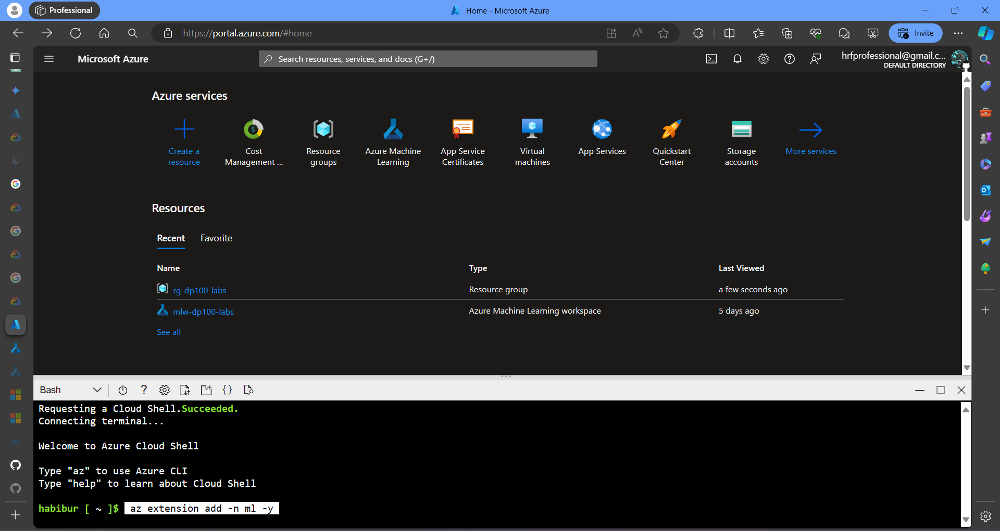
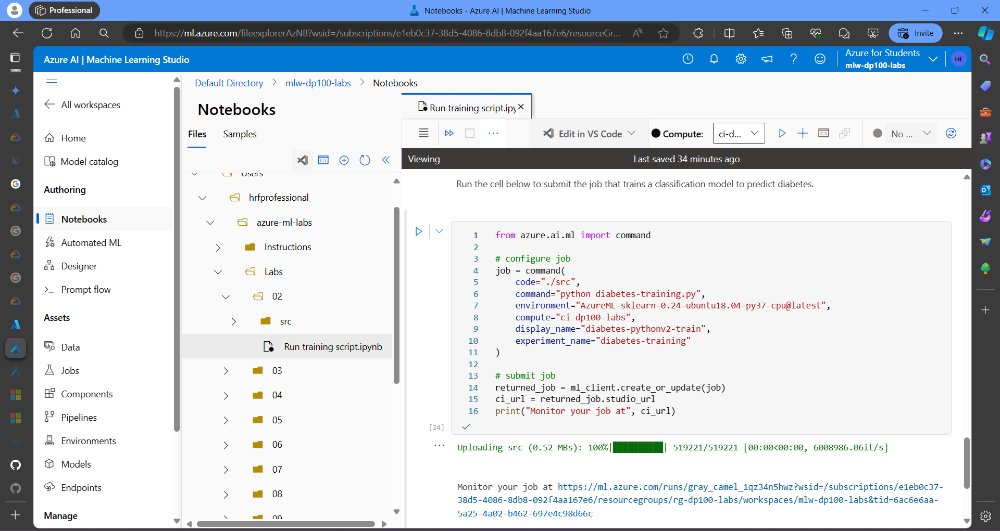
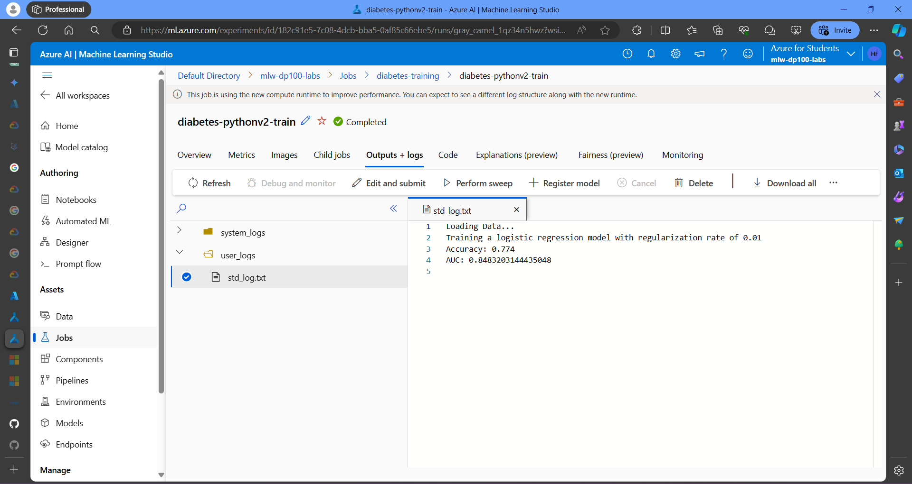

# Purpose

The purpose of this tutorial is to go through the process of provisioning infrastructure and training machine learning models using Azure CLI (Command Line Interface) and Python SDK (Software Development Kit). This gave a comprehensive overview of essential tasks such as creating compute instances and clusters, configuring workstations in the Azure Machine Learning studio, and utilizing Python SDK for model training. By following this tutorial, gained proficiency in setting up the necessary infrastructure and leveraging Azure tools for efficient model development and training.

# Visualizations

**Azure Cmd:** Provides context by showing the Azure portal, highlighting the Azure Machine Learning service. It emphasizes that the workflow takes place within the Azure cloud platform.

**Cloned Notebook and Jobs Detail:** Demonstrates the development environment used to write Python code specifically for machine learning models within the Azure Machine Learning workspace.

**Trained Result:** Illustrates managing the Python code used to build the models. It suggests this is done through a web interface within Azure Machine Learning Studio.

# Objectives

The main objective was to empower with the knowledge and skills required to effectively provision infrastructure and train machine learning models using Azure CLI and Python SDK. Key points as note:

1. Provision infrastructure using Azure CLI, including creating compute instances and clusters.
2. Configure workstations in the Azure Machine Learning studio for streamlined workflow management.
3. Utilize Python SDK to train machine learning models from Jupyter notebooks.
4. Review job history and manage resources in the Azure Machine Learning studio.
5. Delete Azure resources to optimize cost management and resource utilization.

Through practical hands-on exercises and step-by-step guidance, got a strong foundation in utilizing Azure tools for machine learning tasks, enabling them to efficiently develop, train, and manage machine learning models in the cloud environment.